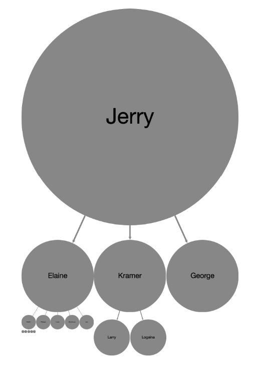
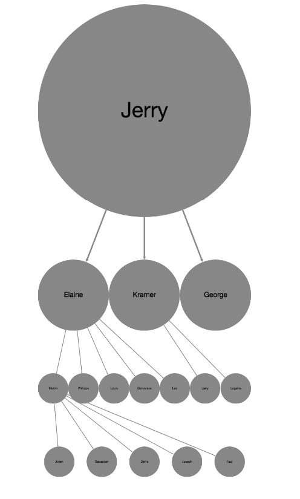

cytoscape-even-parent
================================================================================


## Description

cytoscape tree layout extension to place children of a node evenly underneath it&#39;s parent ([demo](https://mo0om.github.io/cytoscape-even-parent))

| Tree |
| ------ |
|  |


| With the `smart` option set to true  |
| ------ |
|  |

## Dependencies

 * Cytoscape.js ^3.2.0
 * <List your dependencies here please>


## Usage instructions

Download the library:
 * via npm: `npm install cytoscape-even-parent`,
 * via bower: `bower install cytoscape-even-parent`, or
 * via direct download in the repository (probably from a tag).

Import the library as appropriate for your project:

ES import:

```js
import cytoscape from 'cytoscape';
import evenParent from 'cytoscape-even-parent';

cytoscape.use( evenParent );
```

CommonJS require:

```js
let cytoscape = require('cytoscape');
let evenParent = require('cytoscape-even-parent');

cytoscape.use( evenParent ); // register extension
```

AMD:

```js
require(['cytoscape', 'cytoscape-even-parent'], function( cytoscape, evenParent ){
  evenParent( cytoscape ); // register extension
});
```

Plain HTML/JS has the extension registered for you automatically, because no `require()` is needed.


## API

Add the layout on creation of the cytoscape instance. A few options are available.

```
... instanciation of cytoscape ...
    layout: {
        name: 'evenParent',
        childrenSize: 1,          // 1 to ~  ::: Proportion of children/parent
        horizontalPadding: 1000,  // 0 to ~  ::: Horizontal padding between nodes
        verticalPadding: 2000,    // 0 to ~  ::: Vertical padding between nodes
        fontSize: 1000,           // 0 to ~  ::: Size of font
        edgeSize: 200,            // 0 to ~  ::: Size of edge
        horizontalSpread: false,  // boolean ::: Spread the graph horizontally if true
        smart: false              // boolean ::: If true, displays children in rows to get maximum node width
    },
...
```

## Build targets

* `npm run test` : Run Mocha tests in `./test`
* `npm run build` : Build `./src/**` into `cytoscape-even-parent.js`
* `npm run watch` : Automatically build on changes with live reloading (N.b. you must already have an HTTP server running)
* `npm run dev` : Automatically build on changes with live reloading with webpack dev server
* `npm run lint` : Run eslint on the source

N.b. all builds use babel, so modern ES features can be used in the `src`.


## Publishing instructions

This project is set up to automatically be published to npm and bower.  To publish:

1. Build the extension : `npm run build:release`
1. Commit the build : `git commit -am "Build for release"`
1. Bump the version number and tag: `npm version major|minor|patch`
1. Push to origin: `git push && git push --tags`
1. Publish to npm: `npm publish .`
1. If publishing to bower for the first time, you'll need to run `bower register cytoscape-even-parent https://github.com/ciena/cytoscape-even-parent.git`
1. [Make a new release](https://github.com/ciena/cytoscape-even-parent/releases/new) for Zenodo.
